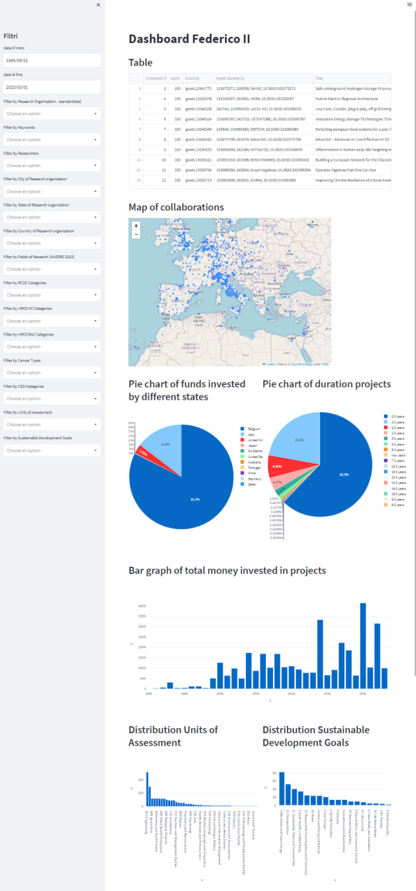

# Homework 1 

Perform at least 5 different descriptive analytics on the dataset related to research projects of the Federico II. Each analytics shall be implemented through Pig, HIVE and PySpark and presented through appropriate reporting.

