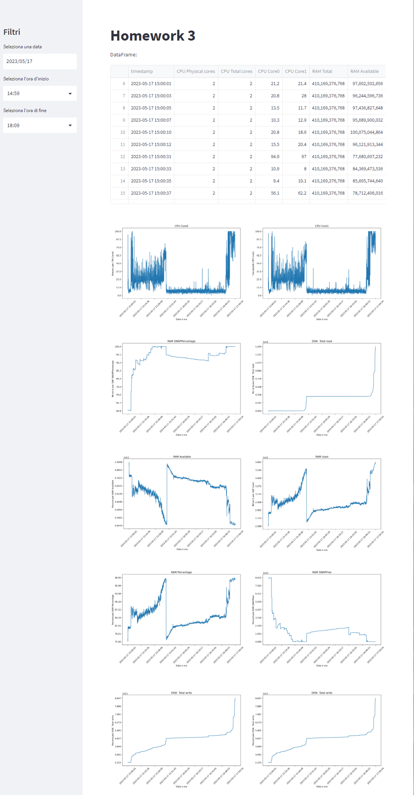

# Homework 3

Using Apache Kafka, manage the acquisition of a data stream (e.g., messages from a web server, measurements from a sensor network, etc.) from a given source (even a simulated one) and subsequent storage in a log file on HDFS. Using one of the tools from the first homework (pyspark, pig or hive), query the data stream and display the results on a special dashboard.

