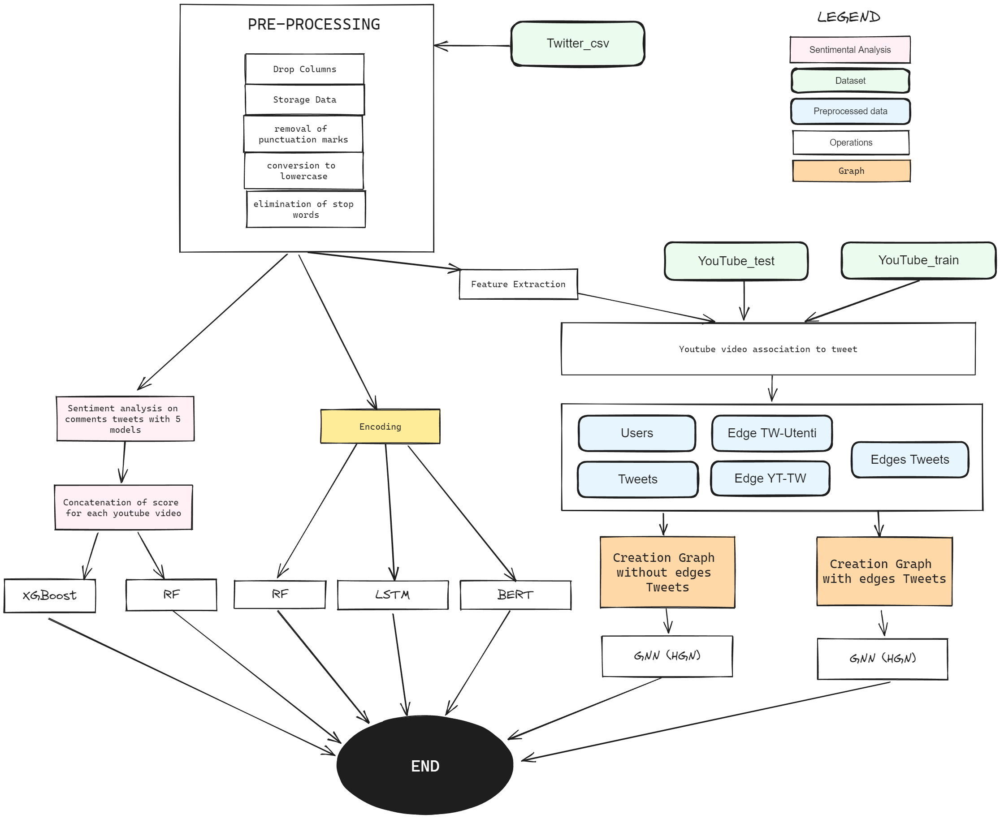

# Youtube-Video-Classification-on-Twitter
Social media platforms play a significant role in shaping the modern digital information ecosystem by allowing users to contribute to discussions on a wide range of topics. However, the freedom of expression offered by these platforms can potentially threaten the integrity of these information ecosystems when harmful content (e.g., fake news, hateful speech) is shared and propagates across the digital population.
To overcome this problem, mainstream social media platforms (e.g., Facebook and Twitter) deploy diverse moderation interventions to target both inappropriate content and the users responsible for spreading it. However, these moderation efforts are typically enacted in a siloed fashion, largely overlooking other platforms’ interventions on harmful content that has migrated to their spaces. This approach poses risks as any harmful content originating on a source platform can migrate to other target platforms, gaining traction with specific communities and reaching a wider audience. Cooperation among social media platforms is therefore desirable but also practically valuable: knowing what content has been deemed inappropriate on another platform can inform moderation strategies, or help with the early detection of similarly harmful, or
related content.
The general objective of the challenge is to assess the validity of the above mentioned statement. Specifically, we consider YouTube (YT) and Twitter as the source and target platforms. The aim of this challenge is to predict whether a YouTube video shared on Twitter will be removed by YouTube.

# Pipeline 

# Docs
- [Presentation](Docs/p): Create collections
- [Documentation](Docs/Documentation.pdf): Associating to each tweet a label 1 if it refers to a moderated video

# Scripts
- [batch_mongoDB](scripts/1-batch_mongoDB.ipynb): Create collections
- [visualize](scripts/1.1-visualize.ipynb): Associating to each tweet a label 1 if it refers to a moderated video
- [filtering_columns](scripts/2-filtering_columns.ipynb): Column filtering not relevant
- [baseline](scripts/2.1-baseline.ipynb): Creation of a field in the youtube collection containg all the text and hashtags of the tweets referring to each video
- [baseline pt2](scripts/2.2-baseline.ipynb): Preprocessing text , XGBoost , RF ,SVM
- [mood](scripts/2.2-mood.py): Feature extraction through sentimental models
- [RNN](scripts/2.3-RNN.ipynb): Prediction with RNN
- [user_tweet_collections_creations](scripts/3-user_tweet_collections_creations.ipynb): generate user and tweet collection
- [feature_extraction](scripts/4-feature_extraction.ipynb): Preprocessing Text , Vectorizer, scaler and label encoder definition
- [test](scripts/5_test.ipynb): Matching tweet_ids updated in yt_collection.
- [BERT](scripts/6-BERT.ipynb): Predictions with BERT
- [test_rnn](scripts/6_test_rnn.ipynb): Test model RNN
- [HGN](scripts/7-HGN.ipynb): Creating a graph with the following edges: YT videos and tweets , tweets and users
- [HGN_link_tweets](scripts/8-HGN_link_tweets.ipynb): Creating a graph with the following arcs: YT videos and tweets , tweets and users , tweets to tweets (rqt/reply/reply to original)

